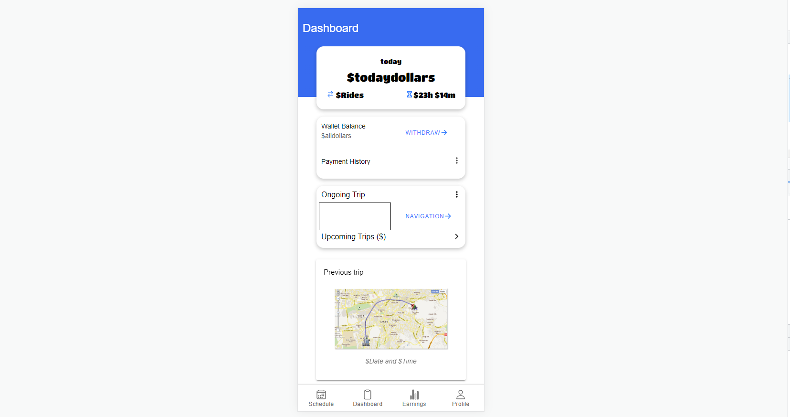
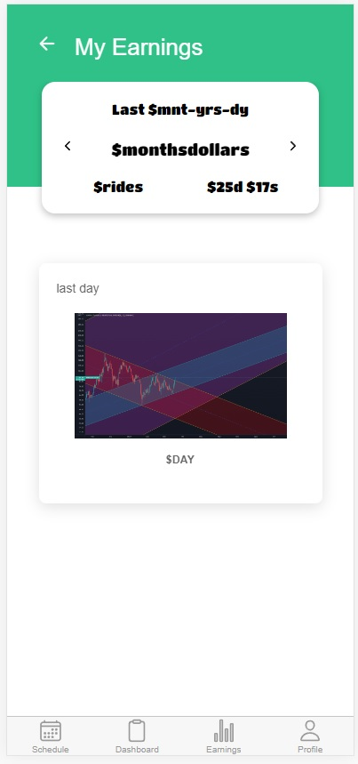
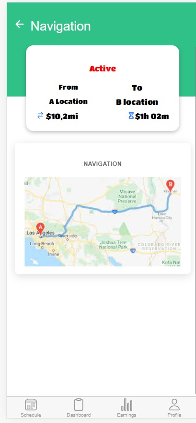
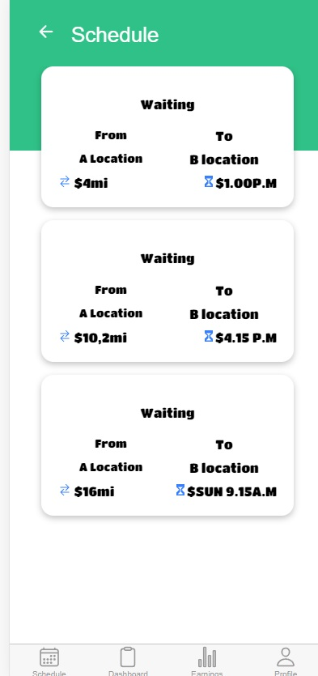

# Shovel-lift

shovel projesi taşımacılık sektöründe boşluk üzerine düsünülmüş bir girisimcilik projesidir. 

## Amaç

shovel app tasımacılık filolarını ve bireysel tasımacılık ihtiyacını bulusturmak üzerine tasarlanmıs bir applikasyondur.   
## Örnek Ekran Görüntüsü

## Kurulum

Burada, projenin nasıl kurulacağına dair adımları açıklayabilirsiniz. Gerekli bağımlılıkları nasıl yükleyeceğinizi veya projeyi nasıl çalıştıracağınızı belirtebilirsiniz.

## Kullanım

Bu bölümde, projenin nasıl kullanılacağını anlatabilirsiniz. Örnek kullanım senaryoları veya kod parçacıkları ekleyebilirsiniz.

## Lisans

Proje hangi lisans altında yayınlanıyorsa burada belirtebilirsiniz. Lisans, projenin kullanım ve dağıtım koşullarını belirler. Açık kaynak projeler için genellikle MIT, Apache, GPL gibi lisanslar tercih edilir.

